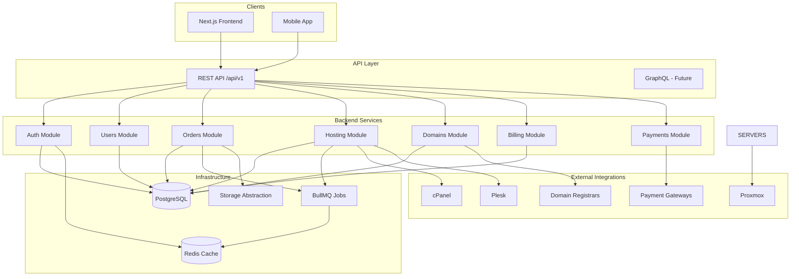

# Architecture

This document describes the system architecture for Vexira Host — an enterprise hosting platform designed for scale, maintainability, and long-term evolution.

## High-Level Overview



## Architectural Principles

### 1. Modular Monolith (Backend)

The backend follows a **modular monolith** pattern — a single deployable unit with clearly bounded modules. Each module owns its domain:

- **auth** — JWT authentication, refresh tokens, RBAC
- **users** — User profiles and account management
- **orders** — Order lifecycle and provisioning orchestration
- **hosting** — Shared, WordPress, Windows, LVE hosting
- **domains** — Registration, transfer, DNS
- **billing** — Invoices, subscriptions, pricing
- **payments** — Payment gateway abstraction
- **tickets** — Support ticket system
- **notifications** — Email, SMS, in-app notifications
- **licenses** — Software license management
- **servers** — VPS and dedicated server management
- **admin** — Admin panel operations
- **audit** — Audit logging and compliance

Each module contains:
```
module/
├── controller/     # HTTP layer — thin, delegates to service
├── service/        # Business logic (future)
├── dto/            # Request/response validation (class-validator)
├── entity/         # Domain entities
├── repository/     # Data access layer (Prisma)
├── interfaces/     # Contracts and abstractions
├── types/          # Module-specific types
└── tests/          # Unit tests
```

### 2. Feature-Based Architecture (Frontend)

The frontend uses **feature-based architecture** — code is organized by business domain, not by technical layer:

```
features/
├── auth/
├── domains/
├── hosting/
├── billing/
├── orders/
└── dashboard/
```

**Rules:**
- UI components contain **no business logic**
- Business logic lives in `hooks/`, `services/`, and `stores/`
- Reusable components live in `components/`
- Each feature is self-contained and independently testable

### 3. Shared Packages

Cross-cutting concerns are extracted into workspace packages:

| Package | Purpose |
|---------|---------|
| `@vexira/types` | Shared TypeScript types and enums |
| `@vexira/config` | Environment validation (Zod) |
| `@vexira/utils` | Pure utility functions |
| `@vexira/api-sdk` | Type-safe HTTP client |
| `@vexira/ui` | Shared UI component library |

## Authentication & Authorization

### JWT + Refresh Tokens

```
Client                    API                     Redis
  │                        │                        │
  ├── POST /auth/login ───►│                        │
  │◄── access + refresh ───┤                        │
  │                        │                        │
  ├── GET /resource ──────►│ (Bearer access token)  │
  │◄── 200 OK ─────────────┤                        │
  │                        │                        │
  ├── POST /auth/refresh ─►│                        │
  │◄── new access token ───┤                        │
```

### Role-Based Access Control (RBAC)

| Role | Level | Description |
|------|-------|-------------|
| `admin` | 100 | Full platform access |
| `staff` | 50 | Support and operational access |
| `customer` | 10 | Self-service customer portal |

Permissions are granular strings (e.g., `orders:manage`, `admin:audit`) checked via `@Permissions()` decorator and `PermissionsGuard`.

## API Design

### REST (Current)

- Versioned: `/api/v1/*`
- Standard response envelope:

```json
{
  "success": true,
  "data": {},
  "timestamp": "2026-06-30T10:00:00.000Z"
}
```

### Error Response

```json
{
  "success": false,
  "error": {
    "code": "VALIDATION_ERROR",
    "message": "Invalid input",
    "details": {}
  },
  "timestamp": "2026-06-30T10:00:00.000Z",
  "path": "/api/v1/resource"
}
```

### GraphQL (Future)

Configuration scaffold exists in `config/graphql.config.ts`. GraphQL will be added as a parallel API layer without replacing REST.

## Data Layer

### PostgreSQL + Prisma

- Schema: `apps/backend/prisma/schema.prisma`
- Migrations: `apps/backend/prisma/migrations/`
- Repository pattern wraps Prisma for testability

### Redis

- Session/token caching
- Rate limiting (future)
- BullMQ connection

## Queue System (BullMQ)

Background jobs for async operations:

| Job | Purpose |
|-----|---------|
| `send-email` | Transactional emails |
| `process-order` | Order provisioning pipeline |
| `sync-server` | Server state synchronization |
| `generate-invoice` | Invoice generation |
| `run-backup` | Backup execution |

## Storage Abstraction

Pluggable storage providers via strategy pattern:

```
StorageProvider (interface)
├── LocalStorageProvider    ✅ Implemented
├── S3StorageProvider       🔲 Scaffold
└── R2StorageProvider       🔲 Scaffold
```

Driver selected via `STORAGE_DRIVER` environment variable.

## Logging

Centralized logging with **Pino**:

- Structured JSON logs in production
- Pretty-printed logs in development
- Request ID correlation via middleware
- Sensitive data redaction (Authorization headers)

## Error Handling

Global exception filter maps HTTP exceptions to standard API error codes:

| HTTP Status | Error Code |
|-------------|------------|
| 400 | `VALIDATION_ERROR` |
| 401 | `UNAUTHORIZED` |
| 403 | `FORBIDDEN` |
| 404 | `NOT_FOUND` |
| 409 | `CONFLICT` |
| 429 | `RATE_LIMITED` |
| 500 | `INTERNAL_ERROR` |

## Scalability Considerations

### Horizontal Scaling

- Stateless API servers behind load balancer
- Redis for shared session/cache state
- BullMQ workers as separate processes
- PostgreSQL read replicas (future)

### Multi-Tenancy

- Tenant isolation at database level (row-level security future)
- Per-tenant resource quotas
- Audit trail for compliance

### Future Integrations

Architecture prepared for:

- **Control Panels:** cPanel, Plesk, DirectAdmin
- **Virtualization:** Proxmox
- **Web Server:** LiteSpeed, CloudLinux
- **Apps:** Softaculous
- **Payments:** Google Pay, Apple Pay, Credit Cards, Bank Transfer
- **Registrars:** Domain registrar APIs

## Testing Strategy

| Layer | Tool | Location |
|-------|------|----------|
| Unit (packages) | Vitest | `packages/*/src/**/*.test.ts` |
| Unit (backend) | Jest | `apps/backend/src/**/tests/*.spec.ts` |
| Unit (frontend) | Vitest | `apps/frontend/src/**/*.test.ts` |
| E2E (frontend) | Playwright | `apps/frontend/tests/e2e/` |
| E2E (backend) | Jest | `apps/backend/test/` |

## Deployment

```
GitHub Actions (CI) → Build → Docker Images → Production
```

- CI: lint, typecheck, test, build on every PR
- Deploy: triggered on merge to `main`
- Docker Compose for local/staging
- Kubernetes-ready container images
