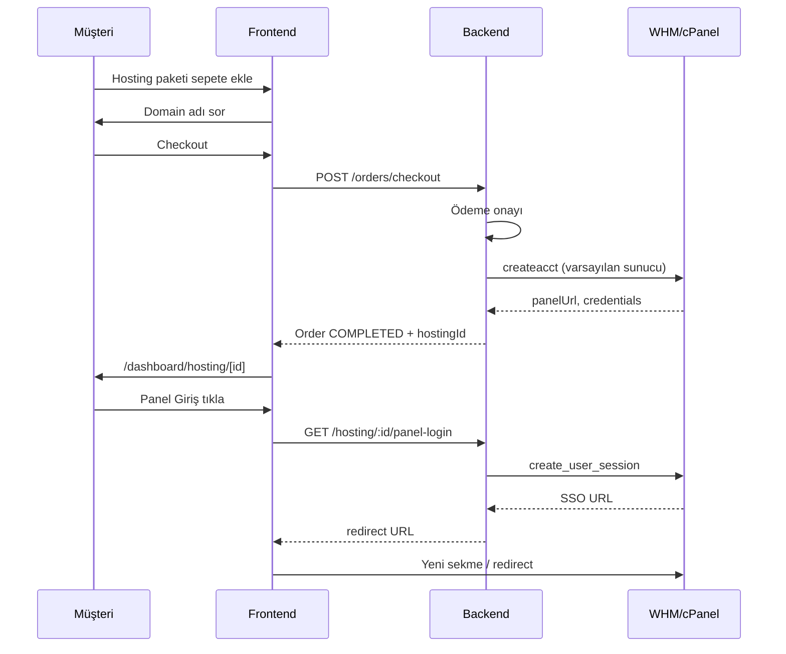

# Vexira Host — Frontend & Admin Panel Yol Haritası

> **Hedef:** WHMCS tarzı müşteri paneli + tam özellikli admin paneli.  
> **Stack:** Next.js 15 · React 19 · Tailwind · next-intl · Zustand · React Hook Form  
> **Backend bağımlılığı:** Her frontend fazı ilgili backend API ile eşleşir.

---

## Mevcut durum (baseline)

| Alan | Sayfa / Bileşen | Durum | Not |
|------|-----------------|-------|-----|
| **Landing** | `/` hero, pricing, infra, testimonials, footer | ✅ | i18n: EN/TR/RU/AZ |
| **Auth** | `/login`, `/register` | ✅ | i18n + OAuth |
| **Dashboard shell** | sidebar + header + toast | ✅ | F1 tamamlandı |
| **Ortak UI** | PageHeader, StatCard, DataTable, StatusBadge… | ✅ | F1 tamamlandı |
| **Domains** | list + detail + DNS + bulk import | ✅ | i18n + export/import zone |
| **Hosting** | list + create + detail + SSO | ✅ | Panel login, provisioning UI |
| **Servers** | list + new + detail/metrics | ⚠️ | Shell var, console UI kapalı |
| **Services** | addon list | ⚠️ | Minimal, refactor yok |
| **Orders / Invoices / Payments / Tickets** | temel + detay sayfaları | ✅ | PDF, ekler, ödeme mock |
| **Cart / Checkout** | sepet + checkout + domain adımı | ✅ | Hosting domain validasyonu |
| **Admin** | `/t4abriz/panel/*` tam panel | ✅ | CRUD, tickets, orders, hosting |
| **Admin hosting sunucuları** | CRUD + test + default | ✅ | Backend + frontend |
| **Panel giriş (SSO)** | Panel Giriş butonu | ✅ | WHM token akışı (mock) |
| **Dashboard i18n** | EN/TR/RU/AZ | ✅ | F6 tamamlandı |

---

## KALAN İŞLER — Özet

### ✅ Tamamlanan (F1)

- Sidebar + collapsible desktop + mobil drawer
- Dashboard header (cart, account, dil seçici)
- `PageHeader`, `Breadcrumb`, `StatCard`, `EmptyState`, `LoadingSkeleton`
- `StatusBadge`, `DataTable`, `ToastContainer`
- Örnek refactor: `/dashboard`, `/dashboard/hosting`

### ⏳ F1 — Kalan (küçük)

- [ ] Domains, Servers, Services, Orders, Invoices, Payments, Tickets, Cart, Account sayfalarında `PageHeader` + `EmptyState` + `StatusBadge` kullanımı
- [ ] Tüm listelerde `LoadingSkeletonList` standardizasyonu

### ⏳ F2 — Müşteri paneli (kısmen tamam)

**Hosting**
- [x] `/dashboard/hosting/[id]` — detay sayfası
- [x] Panel Giriş butonu (F4 backend SSO endpoint)
- [x] `/dashboard/hosting/new` — plan karşılaştırma, domain validasyonu
- [ ] `PROVISIONING` durumunda polling / spinner

**Sepet & sipariş**
- [x] `/dashboard/cart` — hosting ürünü için domain input
- [x] `/dashboard/orders/[id]` — sipariş detay + fatura linki + provision durumu
- [ ] Checkout sonrası hosting varsa `/dashboard/hosting` yönlendirmesi

**Diğer modüller**
- [x] Domains — bulk DNS export/import
- [ ] Domains — transfer wizard polish
- [ ] Servers — power butonları, metrik grafik
- [x] Invoices — PDF indir, ödeme butonu (liste + detay)
- [x] Tickets — dosya eki (müşteri + admin)
- [ ] Tickets — durum filtresi
- [x] Account — 2FA placeholder, API keys

### ⏳ F3 — Admin panel

- [ ] `/dashboard/admin/layout.tsx` — admin sidebar + role guard
- [ ] Overview — `recentOrders` + `recentTickets` tabloları (API hazır, UI yok)
- [ ] `/dashboard/admin/users` — liste, rol değiştir, suspend
- [ ] `/dashboard/admin/orders` + `[id]` — filtre, detay, manuel provision
- [ ] `/dashboard/admin/invoices` — açık faturalar
- [ ] `/dashboard/admin/tickets` — staff kuyruğu, atama, yanıt

**Backend eksik (F3 için)**
- [ ] `PATCH /admin/users/:id` — rol güncelle
- [ ] `PATCH /admin/users/:id/status` — suspend/activate
- [ ] `GET /admin/orders`, `GET /admin/invoices`, `GET /admin/tickets`

### ⏳ F4 — Hosting sunucu + otomatik akış (kritik)

**Backend**
- [x] `HostingServer` Prisma modeli + migration
- [x] `POST/GET/PATCH/DELETE /admin/hosting/servers`
- [x] Varsayılan sunucu seçimi (ilk eklenen = default)
- [x] Mock WHM provider (gerçek API → production)
- [x] Order ödeme sonrası otomatik `provision()` job
- [x] `GET /hosting/:id/panel-login` — SSO redirect URL

**Frontend**
- [ ] `/dashboard/admin/hosting/servers` — liste
- [ ] `/dashboard/admin/hosting/servers/new` — IP, user, şifre formu
- [ ] `/dashboard/admin/hosting/servers/[id]` — düzenle, test, default
- [ ] `/dashboard/admin/hosting/accounts` — tüm müşteri hesapları
- [ ] Müşteri: Panel Giriş butonu + otomatik provision UI

### ⏳ F5 — Admin genişletme

- [ ] `/dashboard/admin/hosting/plans` — CRUD
- [ ] `/dashboard/admin/products` — Product ↔ HostingPlan eşleme
- [ ] `/dashboard/admin/domains/tlds` — TLD fiyat tablosu
- [ ] `/dashboard/admin/servers/plans` — VPS plan CRUD
- [ ] `/dashboard/admin/payments` — işlem logları
- [ ] `/dashboard/admin/system` — queue, mock/real toggle

### ✅ F6 — i18n (dashboard + admin)

- [x] `messages/*.json` → `dashboard.*` namespace
- [x] `messages/*.json` → `admin.*` namespace
- [x] Sidebar nav etiketleri
- [x] Status badge etiketleri
- [x] Form validation mesajları (zod + i18n)
- [x] Public pages, instance components, F2 polish keys (EN/TR/RU/AZ)

### ⏳ F7 — Production polish

- [ ] Dark mode (opsiyonel)
- [ ] Skeleton loading tüm listelerde
- [ ] E2E: login → cart → checkout → hosting
- [ ] Error boundary + 403/404 sayfaları
- [ ] Route-level code splitting

### ⏳ Backend production (frontend dışı)

- [ ] Gerçek registrar API
- [ ] Gerçek Proxmox API
- [ ] Gerçek WHM/cPanel API
- [ ] Stripe / PayPal ödeme
- [ ] E-posta SMTP
- [ ] Invoice PDF
- [ ] Hosting suspend/unsuspend
- [ ] VPS console UI
- [ ] Unit / E2E test coverage

---

## Mimari kararlar

```
apps/frontend/src/
├── app/
│   ├── (marketing)/          # Landing, /hosting public
│   ├── (auth)/               # login, register
│   └── dashboard/
│       ├── layout.tsx        # → sidebar shell (Faz F1)
│       ├── (client)/         # müşteri modülleri
│       └── admin/
│           ├── layout.tsx    # admin sidebar + role guard (Faz F3)
│           ├── page.tsx      # overview
│           ├── servers/      # hosting WHM sunucuları (Faz F4)
│           ├── hosting/      # planlar + hesaplar (Faz F4)
│           ├── orders/
│           ├── invoices/
│           ├── tickets/
│           └── users/
├── components/
│   ├── ui/                   # Button, Badge, Table, Modal… (Faz F1)
│   ├── dashboard/            # Sidebar, PageHeader, StatCard
│   └── admin/
├── features/                 # domain logic + API services (mevcut yapı)
└── messages/                 # dashboard + admin namespace (Faz F6)
```

**Rol bazlı erişim**

| Rol | Görebileceği frontend |
|-----|----------------------|
| `customer` | `/dashboard/*` (admin hariç) |
| `staff` | + `/dashboard/admin` (orders, tickets, hosting hesapları) |
| `admin` | + sunucu yönetimi, kullanıcı rolü, plan CRUD |

---

## Faz F1 — Dashboard kabuğu & ortak UI ✅

**Durum:** Tamamlandı (küçük refactor kaldı)  
**Süre tahmini:** 3–5 gün  
**Backend:** değişiklik gerekmez

### Yapılacaklar

- [x] `DashboardSidebar` — collapsible sidebar, aktif route vurgusu
- [x] `PageHeader`, `StatCard`, `EmptyState`, `LoadingSkeleton`
- [x] `StatusBadge` — `ACTIVE`, `PROVISIONING`, `SUSPENDED` renkleri
- [x] `DataTable` — sort, pagination (client-side başlangıç)
- [x] Mobile drawer menü
- [x] Breadcrumb bileşeni
- [x] Toast / alert sistemi (başarı / hata)
- [x] Dashboard layout shell (sidebar + header)
- [ ] Tüm dashboard sayfalarında yeni bileşenlere geçiş (kısmen: home + hosting)

### Sayfalar

| Route | İş |
|-------|-----|
| `dashboard/layout.tsx` | Sidebar + header refactor |
| `dashboard/page.tsx` | Stat kartları + hızlı aksiyonlar |

### Kabul kriterleri

- Tüm dashboard sayfaları aynı shell'i kullanır
- Mobilde menü kullanılabilir
- Loading / empty / error durumları tutarlı

---

## Faz F2 — Müşteri paneli iyileştirmeleri ⏳

**Durum:** Bekliyor  
**Süre tahmini:** 5–7 gün  
**Backend:** mevcut API yeterli (panel SSO için F4 backend gerekli)

### Yapılacaklar

- [ ] Hosting detay sayfası `/dashboard/hosting/[id]`
- [ ] Panel Giriş butonu
- [ ] Hosting create form iyileştirmesi
- [ ] Cart hosting domain adımı
- [ ] Order detay sayfası
- [ ] Checkout sonrası yönlendirme
- [ ] Domains / Servers / Invoices / Tickets / Account iyileştirmeleri

### 2A — Hosting (müşteri)

| Route | Özellik |
|-------|---------|
| `/dashboard/hosting` | Kart grid, durum badge, plan özeti |
| `/dashboard/hosting/[id]` | Detay: domain, username, panel tipi, oluşturulma |
| `/dashboard/hosting/[id]` | **Panel Giriş** butonu → `GET /hosting/:id/panel-login` (Faz F4 backend) |
| `/dashboard/hosting/new` | Plan karşılaştırma, domain validasyonu |

### 2B — Sipariş & sepet akışı

| Route | Özellik |
|-------|---------|
| `/dashboard/cart` | Ürün kategorisine göre ek alanlar (hosting → domain) |
| `/dashboard/orders/[id]` | Sipariş durumu, fatura linki, provision durumu |
| Checkout sonrası | Hosting ürünü varsa → otomatik yönlendirme `/dashboard/hosting` |

### 2C — Diğer modüller

| Modül | İyileştirme |
|-------|-------------|
| Domains | Transfer wizard, bulk DNS |
| Servers | Power butonları, metrik grafik (recharts) |
| Invoices | PDF indir, ödeme butonu |
| Tickets | Dosya eki, durum filtresi |
| Account | 2FA placeholder, API keys |

### Kabul kriterleri

- Müşteri hosting hesabını detaylı görebilir
- Sepette hosting ürünü için domain sorulur
- Sipariş detayında fatura ve durum görünür

---

## Faz F3 — Admin panel iskeleti ⏳

**Durum:** Bekliyor  
**Süre tahmini:** 4–6 gün  
**Backend:** mevcut `/admin/dashboard`, `/admin/users` + yeni endpoint'ler (Faz F4)

### Yapılacaklar

- [ ] Admin layout + sidebar
- [ ] Overview recentOrders / recentTickets
- [ ] Users yönetimi
- [ ] Orders admin görünümü
- [ ] Invoices admin görünümü
- [ ] Tickets staff kuyruğu

### Layout

```
/dashboard/admin/
├── layout.tsx          # AdminSidebar, staff/admin guard
├── page.tsx            # Overview (stats + recent lists)
├── users/              # Liste, rol değiştir, suspend
├── orders/             # Tüm siparişler, filtre, detay
├── invoices/           # Açık faturalar, manuel işaretle
├── tickets/            # Staff ticket kuyruğu
└── settings/           # Genel ayarlar (placeholder)
```

### Admin Overview (`/dashboard/admin`)

Backend'den gelen ama henüz kullanılmayan veriler:

- `recentOrders` — son 10 sipariş tablosu
- `recentTickets` — açık ticket listesi
- Stats kartları (mevcut)

### Users (`/dashboard/admin/users`)

| Özellik | API |
|---------|-----|
| Kullanıcı listesi | `GET /admin/users` ✅ |
| Rol güncelle | `PATCH /admin/users/:id` ❌ backend gerekli |
| Hesap askıya al | `PATCH /admin/users/:id/status` ❌ |

### Orders / Invoices / Tickets (admin görünümü)

| Sayfa | Özellik |
|-------|---------|
| `/admin/orders` | Filtre: status, tarih, müşteri |
| `/admin/orders/[id]` | Kalemler, fatura, manuel provision tetikle |
| `/admin/invoices` | Ödenmemiş faturalar, hatırlatma |
| `/admin/tickets` | Atama, öncelik, staff yanıt |

### Kabul kriterleri

- Staff/admin rolü olmayan kullanıcı admin'e giremez
- Admin sidebar ile tüm alt modüllere erişim
- Overview'da recent orders/tickets görünür

---

## Faz F4 — Hosting Admin & otomatik provisioning (kritik) ⏳

**Durum:** Backend ✅ — Frontend ✅ (F4 tamamlandı)  
**Süre tahmini:** 7–10 gün  
**Backend:** `HostingServer` modeli, admin CRUD, fulfillment job, panel SSO

### Yapılacaklar

**Backend**
- [x] HostingServer model + migration
- [x] Admin sunucu CRUD API
- [x] Mock WHM provider + SSO session
- [x] Order fulfillment → auto provision
- [x] Panel SSO endpoint

**Frontend**
- [x] Admin sunucu listesi / form / düzenle
- [x] Admin hosting accounts listesi
- [x] Müşteri Panel Giriş + provision polling
- [x] Cart hosting domain adımı

> Bu faz, önceki konuşmada tarif edilen WHMCS akışının tamamını kapsar.

### 4A — Backend (frontend önkoşulu)

| API | Açıklama |
|-----|----------|
| `POST /admin/hosting/servers` | Sunucu ekle (IP, hostname, panel, whmUser, whmPass) |
| `GET /admin/hosting/servers` | Sunucu listesi |
| `PATCH /admin/hosting/servers/:id` | Güncelle / varsayılan yap |
| `DELETE /admin/hosting/servers/:id` | Sil (hesap yoksa) |
| `GET /hosting/:id/panel-login` | SSO redirect URL |
| Order paid webhook / job | Otomatik `provision()` |

**HostingServer alanları (öneri)**

```
name, hostname, ipAddress, panel (CPANEL|PLESK),
whmUsername, whmPasswordEnc, apiTokenEnc,
isDefault, isActive, accountCount, maxAccounts
```

### 4B — Admin frontend: Sunucu yönetimi

| Route | UI |
|-------|-----|
| `/dashboard/admin/hosting/servers` | Sunucu tablosu: IP, panel, durum, hesap sayısı |
| `/dashboard/admin/hosting/servers/new` | Form: IP, hostname, WHM user, şifre, panel tipi |
| `/dashboard/admin/hosting/servers/[id]` | Düzenle, bağlantı testi, varsayılan işaretle |
| `/dashboard/admin/hosting/accounts` | Tüm müşteri hosting hesapları (filtre) |
| `/dashboard/admin/hosting/plans` | Plan listesi (salt okunur → CRUD Faz F5) |

**Sunucu ekleme formu**

```
┌─────────────────────────────────────────┐
│  Yeni Hosting Sunucusu                   │
├─────────────────────────────────────────┤
│  Sunucu adı:    [ WHM-01            ]   │
│  IP adresi:     [ 185.x.x.x         ]   │
│  Hostname:      [ server1.domain.com]   │
│  Panel:         (●) cPanel  ( ) Plesk   │
│  WHM kullanıcı: [ root              ]   │
│  WHM şifre:     [ ••••••••          ]   │
│  [ ] Varsayılan sunucu                  │
│  [ Bağlantıyı test et ]  [ Kaydet ]     │
└─────────────────────────────────────────┘
```

### 4C — Müşteri frontend: otomatik hosting

**Akış diyagramı**



| UI değişikliği | Açıklama |
|----------------|----------|
| Cart | `category === HOSTING` → domain input zorunlu |
| Order success | "Hosting hesabınız oluşturuluyor…" progress |
| Hosting list | `PROVISIONING` → spinner + polling |
| Hosting detail | Panel Giriş, şifre göster (tek seferlik), suspend uyarısı |

### Kabul kriterleri

- Admin ilk sunucuyu ekleyebilir; varsayılan sunucu işaretlenir
- Müşteri hosting satın alınca otomatik hesap oluşur
- Panel Giriş tek tıkla cPanel'e yönlendirir
- Admin tüm hosting hesaplarını görebilir

---

## Faz F5 — Admin genişletme ⏳

**Durum:** Bekliyor  
**Süre tahmini:** 5–7 gün

- [ ] Hosting plan CRUD
- [ ] Ürün kataloğu admin
- [ ] Domain TLD fiyatları
- [ ] VPS plan CRUD
- [ ] Ödeme logları
- [ ] Sistem ayarları

| Modül | Admin sayfası | Özellik |
|-------|---------------|---------|
| Hosting planları | `/admin/hosting/plans` | CRUD, fiyat, limitler |
| Ürün kataloğu | `/admin/products` | Product ↔ HostingPlan eşleme |
| Domain fiyatları | `/admin/domains/tlds` | TLD fiyat tablosu |
| Sunucu planları | `/admin/servers/plans` | VPS plan CRUD |
| Ödemeler | `/admin/payments` | İşlem logları, iade |
| Sistem | `/admin/system` | Queue durumu, mock/real toggle |

---

## Faz F6 — i18n (dashboard + admin) ⏳

**Durum:** Bekliyor (landing/auth ✅)  
**Süre tahmini:** 3–4 gün

- [ ] `dashboard.*` namespace (EN/TR/RU/AZ)
- [ ] `admin.*` namespace
- [ ] Sidebar + status etiketleri
- [ ] Form validation i18n

### Namespace yapısı

```json
{
  "dashboard": { "nav": {}, "hosting": {}, "orders": {} },
  "admin": { "nav": {}, "servers": {}, "users": {} },
  "status": { "ACTIVE": "", "PROVISIONING": "" }
}
```

### Öncelik sırası

1. Dashboard sidebar + ortak etiketler
2. Hosting modülü (müşteri + admin)
3. Admin users / orders
4. Kalan modüller

---

## Faz F7 — UX polish & production ⏳

**Durum:** Bekliyor  
**Süre tahmini:** 4–5 gün

- [ ] Dark mode (opsiyonel)
- [ ] Skeleton loading tüm listelerde
- [ ] Form validation mesajları (zod + i18n)
- [ ] SEO meta dashboard public sayfaları
- [ ] E2E testler (Playwright): login → cart → checkout → hosting
- [ ] Error boundary + 404/403 sayfaları
- [ ] Performans: route-level code splitting

---

## Öncelik matrisi

| Öncelik | Faz | Durum | Neden |
|---------|-----|-------|-------|
| 🔴 P0 | **F1** | ✅ Bitti | Ortak UI tamamlandı |
| 🔴 P0 | **F4** | ⏳ Sırada | Sunucu + otomatik hosting + panel SSO |
| 🟠 P1 | **F3** | ⏳ Bekliyor | Admin operasyonları |
| 🟠 P1 | **F2** | ⏳ Bekliyor | Müşteri deneyimi |
| 🟡 P2 | **F5** | ⏳ Bekliyor | Operasyonel esneklik |
| 🟡 P2 | **F6** | ⏳ Bekliyor | Çok dilli dashboard |
| 🟢 P3 | **F7** | ⏳ Bekliyor | Production hazırlık |

---

## Önerilen uygulama sırası (sprint planı)

| Sprint | Faz | Deliverable | Durum |
|--------|-----|-------------|-------|
| **S1** | F1 | Sidebar shell + ortak bileşenler | ✅ Tamamlandı |
| **S2** | F4 backend | HostingServer + admin API + SSO endpoint | ✅ Tamamlandı |
| **S3** | F4 frontend | Admin sunucu UI + müşteri panel giriş | ✅ Tamamlandı |
| **S4** | F3 | Admin overview, users, orders, tickets | ⏳ Sırada |
| **S5** | F2 | Cart domain adımı, hosting detail, order flow | ⏳ Bekliyor |
| **S6** | F5 + F6 | Plan CRUD, i18n dashboard | ⏳ Bekliyor |
| **S7** | F7 | Test, polish, deploy | ⏳ Bekliyor |

---

## Dosya checklist (F4 admin sunucu örneği)

```
apps/frontend/src/
├── app/dashboard/admin/
│   ├── layout.tsx                    # NEW
│   ├── hosting/
│   │   ├── servers/
│   │   │   ├── page.tsx              # NEW — liste
│   │   │   ├── new/page.tsx          # NEW — form
│   │   │   └── [id]/page.tsx         # NEW — düzenle
│   │   └── accounts/page.tsx         # NEW
├── features/admin/
│   ├── services/
│   │   └── hosting-servers.service.ts  # NEW
│   └── components/
│       ├── admin-sidebar.tsx         # NEW
│       └── hosting-server-form.tsx   # NEW
└── messages/
    └── en.json → admin.* namespace   # NEW
```

---

## Backend ↔ Frontend eşleme tablosu

| Frontend ihtiyaç | Backend endpoint | Durum |
|------------------|------------------|-------|
| Admin stats | `GET /admin/dashboard` | ✅ |
| Admin users | `GET /admin/users` | ✅ |
| Admin sunucu CRUD | `POST/GET/PATCH/DELETE /admin/hosting/servers` | ✅ |
| Panel SSO | `GET /hosting/:id/panel-login` | ✅ |
| Otomatik provision | Order fulfillment on payment | ✅ |
| Hosting hesap detay | `GET /hosting/:id` | ✅ |
| Plan listesi | `GET /hosting/plans` | ✅ |

---

## İlgili dokümanlar

- [ROADMAP.md](./ROADMAP.md) — Genel platform fazları
- [API.md](./API.md) — REST endpoint referansı
- [Architecture.md](./Architecture.md) — Sistem mimarisi

---

*Son güncelleme: 2026-07-01 — F6 tamamlandı, F2 kısmen tamam (PDF, ekler, bulk DNS, cart/account polish)*
